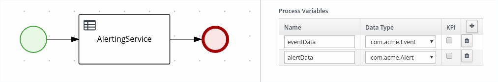
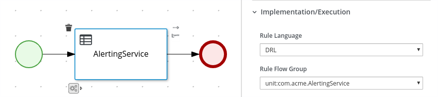

Kogito, ergo Rules: From Knowledge To Service, Straight
=======================================================

Welcome to another episode of this blog series on the Kogito initiative and our efforts to bring Drools to the cloud. The goal of these posts is to gather early user feedback on the features we are delivering to Kogito.

In this post we present **two new ways** to realize a complete intelligent service:

1. self-contained rule services
2. integrated intelligent workflows with rule tasks

## Units of Execution in Kogito

As you may already know, in Kogito we are making front-and-center the new [Unit](http://blog.athico.com/2019/07/kogito-ergo-rules-part-2-all.html) concept.

"Unit of execution" that we use to indicate an executable piece of knowledge. A unit may be a process, a set of rules, a decision, etc... In the case of a set of rules, we call it a *rule unit*. If you opt-in to use units, **in Kogito** we will take care of all the boilerplate that is required to generate a **REST endpoint** automatically.

A rule unit is constituted by primarily by

1) a data definition;
2) the set of rules and queries that implement the behavior of the unit (the rules of the rule engine); 
3) optionally, event listeners may be attached for a number of purposes.

In this post we'll focus on data definitions, rules and queries.

**Data definitions** are given by declaring a Java class that may contain data sources. Each data source represents a partition of the working memory that your rules will pattern match against or insert to. 

For instance, suppose you want to declare an alerting service that receives events and produces alerts
depending on some conditions. We declare `Event` and `Alert` objects as follows:

```java
package com.acme;
public class Event {
   String type;
   int value;
   // getters and setters
}

public class Alert {
  String severity;
  String message;
  // getters and setters
}
```
The `AlertingService` unit type declaration is a class that implements the interface `RuleUnitData`.

```java
package com.acme;
public class AlertingService implements RuleUnitData {
   private final DataStream<Event> eventData = DataSource.createStream();
   private final DataStream<Alert> alertData = DataSource.createStream();
   // getters and setters
}
```


**Rules** are defined in DRL files as usual, except that you have now to indicate their **unit** at the top of the file. For instance you may declare the data definition for `AlertingService` as follows: 

```java
package com.acme;
unit AlertingService;
rule IncomingEvent when
   // matches when a temperature higher than 30 °C is registered (OOPath syntax)
   $e : /eventData [ type == "temperature", value >= 30 ] 
then
   System.out.println("incoming event: "+ $e.getMessage());
   alertData.append( new Alert( "warning", "Temperature is too high" ) );
end
```

As you can see, rules may match against or insert to the given data sources.

**Queries** are defined in DRL files like rules, and belong to a unit, too. 
If you declare at least one query, you will get **a REST endpoint automatically generated for free**. 
For instance:


```java
query Warnings
   alerts: /alertData [ severity == "warning" ]
end
```

will generate the REST endpoint `/warnings` that you will be able to invoke by POST-ing to it as follows:


```sh
	$ curl -X POST \
           -H 'Accept: application/json' \
           -H 'Content-Type: application/json' \
           -d '{ "eventData": [ { "type": "temperature", "value" : 40 } ] }' \
           http://localhost:8080/warnings
```

This will generate the response:

```json
[ { "severity": "warning", "message" : "Temperature is too high" } ]
```

The Java-based data definition is very familiar to programmers, but, from early user feedback, *we decided to provide two alternative methods to declare a rule unit*. We are publishing this blog post to gather more user feedback!

## Type Declaration

The *type declaration* is the DRL feature to declare Java-compatible types,
in a Java-agnostic way. In the 7 series, users may declare types with the syntax:

```java
package com.acme;

declare Event
   type:  String
   value: int
end

declare Alert
  severity: String
  message:  String
end
```

This makes the DRL completely self-contained: entities and rules may be all defined using DRL. However, they have few limitations; for instance,
they do not support implementing interfaces and they do not support generic type fields. In other words, the following declaration, used to be syntactically invalid:

```java
package com.acme;
declare AlertingService extends RuleUnitData
   eventData: DataStream<Event>
   alertData: DataStream<Alert>
end
```

In version 0.8.0 (not out yet), we are lifting these limitations: we allow limited inheritance for interfaces (only one is allowed for now) and generic type declaration for fields. With these new features, the following piece of code becomes valid DRL.

Long story short: **you are now able to declared a full microservice
from a single DRL**.

Bootstrap your Kogito service with

```sh
	$ mvn io.quarkus:quarkus-maven-plugin:create \
			-DprojectGroupId=com.acme \
			-DprojectArtifactId=kogito-rules \
			-Dextensions="kogito"
```

Drop this DRL to `src/main/resources` folder

```java
package com.acme;

declare Event
   type:  String
   value: int
end

declare Alert
  severity: String
  message:  String
end

declare AlertingService extends RuleUnitData
   eventData: DataStream<Event>
   alertData: DataStream<Alert>
end

unit AlertingService;

rule IncomingEvent when
   // matches when a temperature higher than 30 °C is registered (OOPath syntax)
   $e : /eventData [ type == "temperature", value >= 30 ] 
then
   System.out.println("incoming event: "+ $e.getMessage());
   alertData.append( new Alert( "warning", $e ) );
end

query Warnings
   alerts: /alertData [ severity == "warning" ]
end
```

then fire up the Quarkus instance with:

	$ mvn compile quarkus:dev

There you go, you are now ready to `curl` your service:

	$ curl -X POST \
           -H 'Accept: application/json' \
           -H 'Content-Type: application/json' \
           -d '{ "eventData": [ { "type": "temperature", "value" : 40 } ] }' \
           http://localhost:8080/warnings

## Workflow Integration

Another way to expose a rule-based service is through a *workflow*.

A *workflow* (sometimes called a "business process") describes a sequence of 
steps in a diagram and it usually declares *variables*: data holders for
values that are manipulated in the execution. The data type of one such variable
may be *anything*: you may use Java classes, but, in this example, we will
use again our declared data types. 

```java
package com.acme;

declare Event
   type:  String
   value: int
end

declare Alert
  severity: String
  message:  String
end
```

Let us call this workflow `com.acme.AlertingWorkflow`, and declare the variables `eventData` and `alertData`:




A workflow that includes a *rule task* may skip the rule unit data *declaration* altogether: in this case the rule unit is inferred directly the structure of the process: each variable will be **inserted into data source of the same name**.



The *name* of the unit is declared by the process, using the syntax `unit:com.acme.AlertingService`.
You are still free to explicitly declare the unit `com.acme.AlertingService`; in that case, the process will the declaration that you have hand-coded.

Note: You may have noticed that we are using the "Rule Flow Group" field. We will a more explicit support to the UI in the future.

You can now drop the process and the following DRL to `src/main/resources` folder.

```java
package com.acme;

declare Event
   type:  String
   value: int
end

declare Alert
  severity: String
  message:  String
end

unit AlertingService;

rule IncomingEvent when
   // matches when a temperature higher than 30 °C is registered (OOPath syntax)
   $e : /eventData [ type == "temperature", value >= 30 ]
then
   System.out.println("incoming event: "+ $e.getMessage());
   alertData.append( new Alert( "warning", $e ) );
end
```

As you may have noticed, you are not required to declare a query explicitly: the process will display
the contents of the variables as a response; it will generate the endpoint `/AlertingWorkflow`, and it accept a `POST` request of the following form:

	$ curl -X POST \
           -H 'Accept: application/json' \
           -H 'Content-Type: application/json' \
           -d '{ "eventData": [ { "type": "temperature", "value" : 40 } ] }' \
           http://localhost:8080/AlertingWorkflow

The reply will be:


```json
{ 
   "eventData" : [ { "type": "temperature", "value" : 40 } ],
   "alertData" : [ { 
      "severity": "warning", 
      "message" : "Temperature is too high" 
   } ] 
}
```

However, if you *do* declare a query, a separate endpoint will be available as well. For instance
if you declare the query `Warnings` you will still be able to POST to `http://localhost:8080/warnings` and invoke the rule service separately.


## Conclusion

We have given a sneak peek on the work that we are doing to improve the getting started experience with rules and processes in Kogito. With these changes, we hope to have provided a more streamlined way to define knowledge-based services. Developers will always able to be more explicit about the data they want to process, by opting-in to writing Java; but if they want, they can embrace a fully DSL-centric development workflow.
